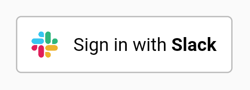

[](https://pub.dartlang.org/packages/flutter_slack_oauth_firebase) 

# flutter_slack_oauth_firebase

Extension for our [flutter_slack_oauth](https://pub.dartlang.org/packages/flutter_slack_oauth) library which adds support for Firebase Authentication and Cloud Firestore.



## Usage
* To use this plugin, add `flutter_slack_oauth_firebase` as a dependency in your pubspec.yaml file. 

* This package depends on [Firebase Auth](https://pub.dartlang.org/packages/firebase_auth), so be sure to follow those steps. Unlike the documentation for that package, the Google Sign-in plugin for Firebase Auth is **NOT** required!

* Deploy the Firebase Functions project in the `firebase` folder, which is the "backend" logic that will handle the OAuth flow. You can follow the steps as specified in the [Instagram Oauth Firebase Functions sample](https://github.com/firebase/functions-samples/tree/master/instagram-auth).


### After succesful login
* The resulting access token for Slack is stored in Firebase Firestore in the `slackAccessToken` collection under a document with the Slack UID as document id.
* User info returned from the Slack login is stored in Firebase Firestore in the `users` collection under a document with the Slack UID as document id.
* You can easily find the Slack UID for the current user after login:

``` dart
FirebaseUser user = await _auth.currentUser();
print(user.uid);

```

### Full Example
``` dart
import 'package:firebase_auth/firebase_auth.dart';
import 'package:flutter/material.dart';
import 'package:flutter_slack_oauth_firebase/flutter_slack_oauth_firebase.dart';

void main() {
  final FirebaseAuth _auth = FirebaseAuth.instance;

  runApp(new MaterialApp(
    home: new Scaffold(
      appBar: new AppBar(
        title: new Text("Slack OAuth Example"),
      ),
      body: new Builder(
        builder: (BuildContext context) {
          return new Center(
            child: new FirebaseSlackButton(
              clientId: "XXX_CLIENT_ID_XXX",
              clientSecret: "XXX_CLIENT_SECRET_XXX",
              redirectUrl:
              "https://XXX-FIREBASE-PROJECT-XXX.firebaseapp.com/completed.html",
              firebaseUrl:
              "https://XXX-FIREBASE-PROJECT-XXX.firebaseapp.com/index.html",
              onSuccess: () async {
                // get Firebase User:
                FirebaseUser user = await _auth.currentUser();

                Scaffold.of(context).showSnackBar(new SnackBar(
                  content: new Text('Logged in with Slack ID ' + user.uid),
                ));
              },
              onFailure: () {
                Scaffold.of(context).showSnackBar(new SnackBar(
                      content: new Text('Slack Login Failed'),
                    ));
              },
              onCancelledByUser: () {
                Scaffold.of(context).showSnackBar(new SnackBar(
                      content: new Text('Slack Login Cancelled by user'),
                    ));
              },
            ),
          );
        },
      ),
    ),
  ));
}

```

